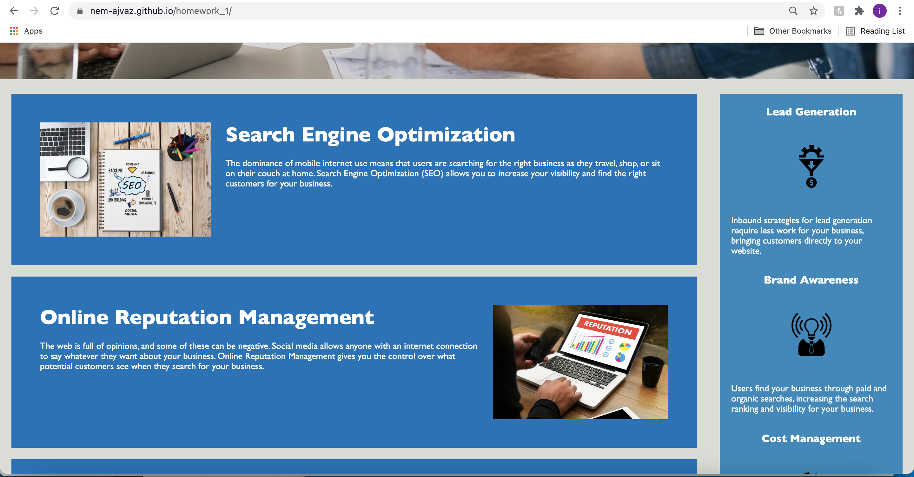
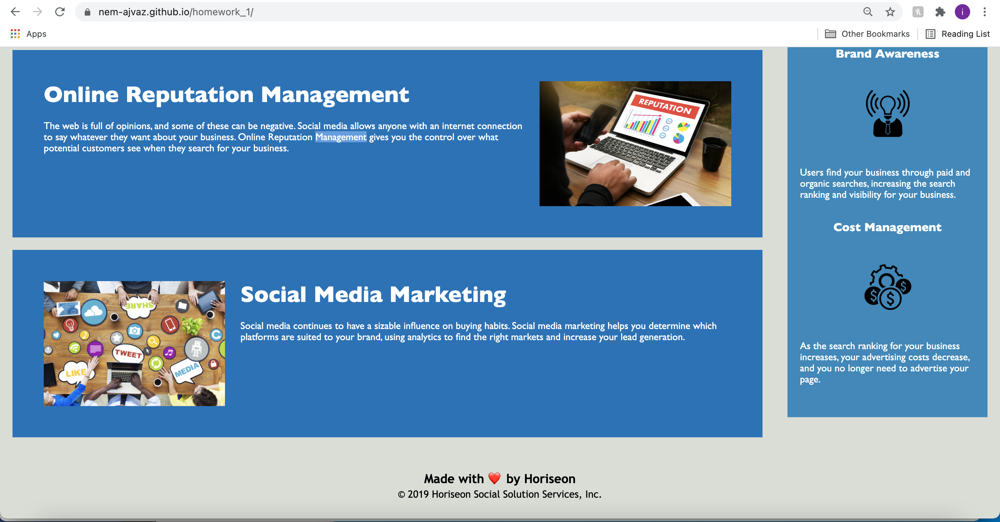

# homework_1

## Installation
To clone and run this project, please make sure you have git installed.

run `git clone https://github.com/Nem-Ajvaz/homework_1.git`

## Description
This code has been refactored to use semantic html elements instead of generic divs and to clean up the css classes and group the similar selectors.

## Images

## Issues faced
A lot of the semantic html elements seemed to do the same thing so it was a little bit of a struggle to choose the correct one.

## Lisence 
MIT
